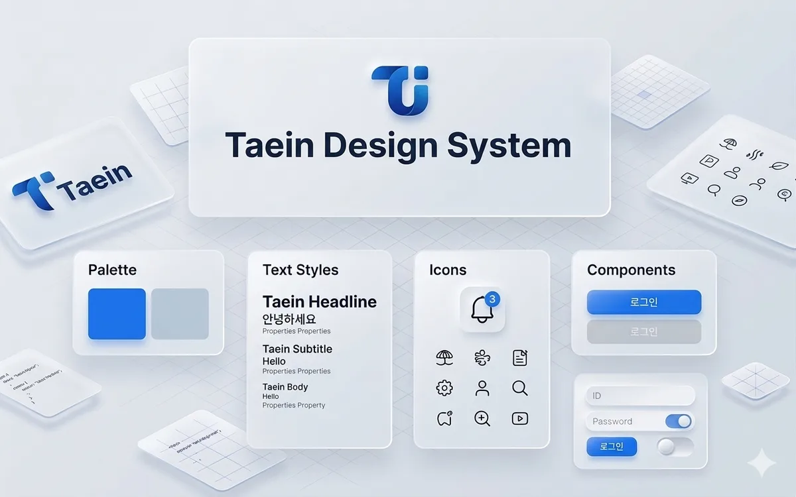
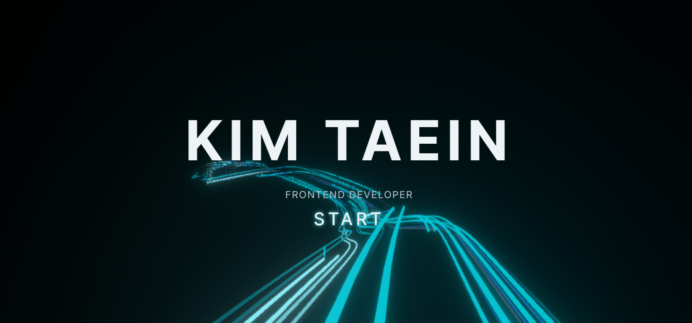
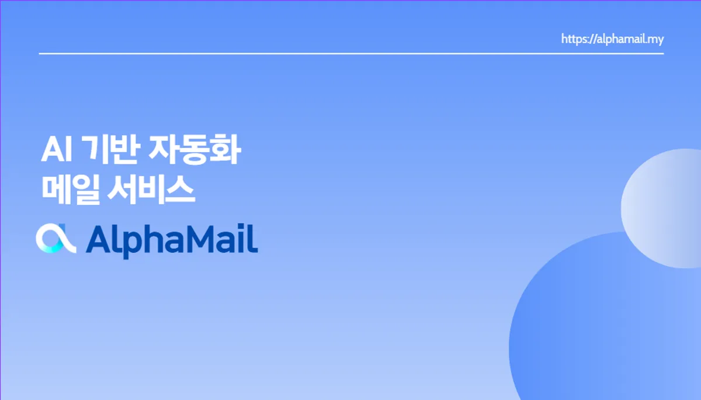
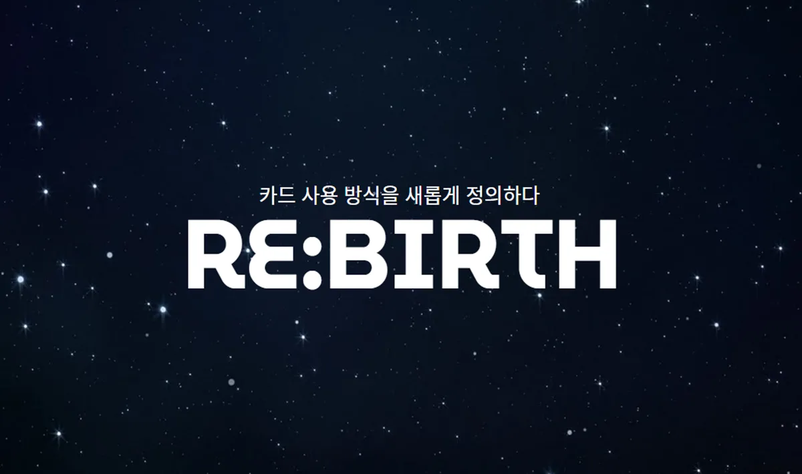
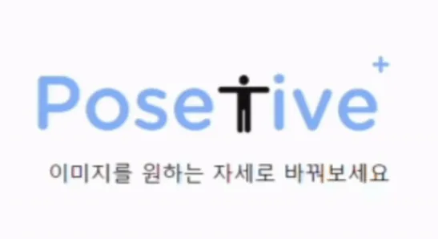

# Portfolio · 김태인의 프론트엔드 포트폴리오

스크롤 대신 전환으로 읽는 단일 페이지 포트폴리오로 구성해봤습니다. 배경은 three.js + GSAP 기반입니다. 부팅부터 마지막 섹션까지 배경이 끊기지 않고 돌고, 다섯 섹션은 그 위에서 교차하는 식으로 설계했습니다.

https://kimtaein.vercel.app/

## 섹션 구성

부팅 시퀀스를 지나면 아래 다섯 섹션이 이 순서로 놓입니다. `lib/constants.ts`의 `HOME_SECTION_CONFIG` 하나가 순서를 정합니다. 내비게이션과 등장 지연도 같은 곳에서 나옵니다.

| 섹션 | 무엇을 보여주는가 |
|------|------|
| **Boot** | 파티클이 이름으로 뭉치는 진입 화면. START를 누르면 터널이 가속하며 여정이 시작됩니다 |
| **About** | 세 문항으로 나눈 자기소개. 문항을 넘길 때마다 배경 세기가 바뀝니다. 각 문항은 말 대신 시각 증거를 답으로 내놓습니다 |
| **Projects** | 프로젝트 이름 목록과 프리뷰. 이름을 고르면 프리뷰가 전체 화면 상세로 펼쳐집니다 |
| **Experience** | 경력과 교육을 단일 축 위에 올린 타임라인 |
| **Skills** | 카테고리별 레인에 놓인 기술 스택. 호버하면 아이콘 모양을 따라 광휘가 뻗습니다 |
| **Awards** | 수상과 자격증을 주관사 마크로 묶은 원장. 줄을 눌러 펼칩니다 |

## 프로젝트 목록

프로젝트마다 문제 하나를 골라 진단, 선택지, 실행, 결과 순으로 적었습니다. 아래 성과는 각 프로젝트 상세의 대표 지표입니다.

<table>
<tr>
<td width="180"></td>
<td>

### TDS (Taein Design System)
`2025.12 - 2026.07` · 1인 설계 및 개발

직접 만들며 배우려고 시작한 개인 디자인 시스템. 라이브러리를 만드는 쪽과 가져다 쓰는 쪽을 한 번에 겪었습니다.

> **Button 하나만 import해도 컴포넌트 전체가 번들에 실리던 현상**
> 번들 45KB에서 4.17KB로

`React 19` `TypeScript` `Vanilla Extract` `Vite` `Vitest` `pnpm Monorepo` `TDD`

</td>
</tr>
<tr>
<td width="180"></td>
<td>

### Portfolio
`2025.08 - 현재` · 1인 개발

지금 보고 계신 이 저장소입니다. 1차 MVP 이후 전면 디자인 리팩토링을 거쳤습니다.

> **배경을 지연 로딩했더니 배경에 구현해둔 기능이 사라진 현상**
> 기능 복구, 첫 화면은 166.3KB 유지

`Next.js 15` `React 19` `TypeScript` `Tailwind CSS 4` `GSAP` `three.js`

</td>
</tr>
<tr>
<td width="180"></td>
<td>

### AlphaMail
`2025.04 - 2025.05` · 6명 · 프론트엔드 리더

메일 내용을 읽어 업무로 정리해주는 AI 업무 자동화 웹 메일 서비스.

> **메일로 들어온 내용이 대시보드에 실시간으로 정리되지 않던 현상**
> 10초 주기 조회에서 실시간에 가까운 갱신으로

`React` `TypeScript` `React Query` `Zustand` `TailwindCSS` `MaterialUI` `FSD`

</td>
</tr>
<tr>
<td width="180"></td>
<td>

### ReBirth
`2025.02 - 2025.04` · 6명 · 모바일 프론트엔드

가진 카드의 혜택을 따져 결제 수단을 골라주는 모바일 페이 서비스.

> **결제 중 SSE 연결이 끊기고 동시 결제 대기가 쌓이던 문제**
> 자동 재연결과 상태 분리로 결제 흐름 안정화

`Kotlin` `Jetpack Compose` `Coroutines` `MVVM` `Retrofit` `Material3`

</td>
</tr>
<tr>
<td width="180"></td>
<td>

### Ttabong
`2025.01 - 2025.02` · 6명 · 웹 프론트엔드

따뜻한 봉사, 따봉. 봉사 기관과 봉사자를 잇는 SNS 큐레이팅 매칭 플랫폼.

> **공고를 한 장씩 훑고 바로 고르게 만들기**
> 탐색부터 관심 등록까지 카드 한 장으로 연결

`React` `TypeScript` `TailwindCSS` `Zustand`

</td>
</tr>
<tr>
<td width="180"></td>
<td>

### Dragon Bar
`2026.08 - 현재` · 1인 외주 · 기획부터 구현까지

Dragonvape 자사 무니코틴 액상 브랜드의 독립몰. 설계와 구현을 혼자 맡았습니다.

> **관리자 페이지에서 상세에 다녀오면 검색 조건이 매번 초기화되던 문제**
> 목록 파라미터를 읽는 코드를 한 곳으로 모아 18개 파일이 공유

`Next.js 16` `React 19` `TypeScript` `Tailwind CSS 4` `Zod` `Prisma` `PostgreSQL` `Playwright`

</td>
</tr>
<tr>
<td width="180"></td>
<td>

### PoseTive
`2024.03 - 2024.06` · 6명 · AI 모델링

사용자가 그린 대로 이미지 속 인물의 포즈를 바꿔주는 AI 웹 서비스.

> **학습이 길어질수록 검증 성능이 떨어지던 과적합**
> 조기 종료로 검증 정확도 88%, 범용 정확도 87%

`Python` `PyTorch` `Pose Estimation` `Pandas` `NumPy`

</td>
</tr>
</table>

## 고도화

1차 MVP를 만든 뒤 화면 전체를 다시 설계했습니다. 배경과 부팅부터 갈아엎었고 섹션을 하나씩 재작성한 다음, 죽은 코드를 걷어내고 검증 장치를 얹었습니다.

| 갈래 | 한 일 |
|------|------|
| **진입** | 터미널 연출 1,230줄을 폐기하고 2초 부팅 시퀀스로 교체. 광선과 파티클로 진입 화면을 다시 만들었습니다 |
| **배경** | Hyperspeed를 명령형 ref API로 포크해 동적 import, 폴백, WebGL 컨텍스트 손실 처리를 붙였습니다. 기기 등급 사다리로 품질을 내립니다 |
| **전환** | 섹션 전환을 터널 깊이 교차로 통일했습니다. 모든 섹션을 DOM에 남긴 채 감추고 다음 섹션은 유휴 시간에 미리 렌더합니다 |
| **About** | 12칸 격자 한 배치로 재작성. 문항마다 배경 세기를 달리했고 넘어갈 때는 터널을 통과합니다. 빈 칸은 문장 대신 보여주는 장치로 채웠습니다 |
| **Projects** | 가로 스트립을 깊이 덱으로 바꿨다가, 두 번째로 이름 목록과 프리뷰로 갈아엎었습니다. 프리뷰에서 상세로는 GSAP Flip, 프로젝트 사이는 셰이더 모프로 잇습니다 |
| **상세 모달** | 상자 다섯 개를 시간 축 한 줄기로 묶었다가 좌증거·우논증 두 판으로 확정. 전체 화면으로 넓히고 History에 태워 뒤로가기로 닫습니다 |
| **Skills · Experience · Awards** | 각각 네온 아이콘 레인, 단일 축 타임라인, 눌러 펼치는 원장으로 재작성했습니다 |
| **셸** | Contact 섹션을 걷어내 다섯 섹션으로 확정했고 하단 이메일은 클립보드 복사로 바꿨습니다 |
| **정리** | framer-motion과 안 쓰는 원자 12개, 죽은 토큰과 고아 CSS를 걷어냈습니다. CSP는 Report-Only로 먼저 붙였습니다 |
| **검증** | 프로젝트 공개 최소 계약을 순수 판정기로 세우고, 번들 예산을 CI에 걸고, 브라우저 3종 E2E 20건을 얹었습니다 |

## 프로젝트 구조

```
portfolio/
├── app/                        # Next.js App Router
│   ├── layout.tsx              # 루트 레이아웃 (메타데이터, 임계 CSS)
│   ├── page.tsx                # 진입점
│   ├── opengraph-image.tsx     # OG 이미지 동적 생성
│   ├── icon.tsx                # 파비콘·앱 아이콘
│   ├── sitemap.ts              # 사이트맵
│   ├── robots.ts               # 로봇 설정
│   └── manifest.ts             # PWA 매니페스트
├── components/
│   ├── atoms/                  # Icon, Modal
│   ├── blocks/
│   │   ├── Hyperspeed/         # three.js 터널 (distortions, presets)
│   │   ├── HyperspeedBackground.tsx  # 배경 배선과 동적 로딩
│   │   ├── ParticleText/       # 이름을 뭉치는 파티클
│   │   ├── PreviewMorph/       # 프로젝트 사이 셰이더 모프
│   │   ├── ProjectModal/       # 좌증거·우논증 상세 판
│   │   ├── Navigation/
│   │   └── About*/             # About 시각 증거 (Folder, Rings, Teamwork)
│   ├── common/                 # SectionActivityContext, WhenVisible
│   ├── sections/               # BootSequence, HomeClient, 다섯 섹션
│   └── seo/                    # JSON-LD
├── hooks/                      # useSectionNav, useSectionSwipe, useModal 등 8개
├── lib/
│   ├── data/                   # 프로필, 경력, 스킬, 프로젝트 7개
│   ├── utils/                  # cn, contrast, format, projectContract, richText
│   ├── theme/darkTokens.ts     # 첫 페인트용 다크 토큰
│   ├── constants.ts            # 섹션 순서와 내비게이션 정본
│   ├── criticalCss.ts          # 흰 화면 번쩍임을 막는 인라인 CSS
│   ├── deviceQuality.ts        # 기기 등급 사다리
│   └── gsap.ts                 # GSAP 지연 등록
├── styles/design-tokens.css    # 값 정본 (색, 타입, 지속, 이징, 간격)
├── types/                      # 데이터 모델 타입
├── __tests__/                  # Vitest 48개 파일
├── e2e/                        # Playwright 6개 스펙
├── scripts/check-bundle.mjs    # 번들 예산 검사
├── DESIGN.md                   # 디자인 정본 진입점
└── public/
    ├── fonts/                  # Pretendard 웹폰트
    └── projects/               # 프로젝트 이미지와 구현 화면 녹화
```

## 기술 스택

| 구분 | 기술 |
|------|------|
| 프레임워크 | Next.js 15 (App Router) |
| 언어 | TypeScript 5 (strict) |
| 스타일링 | Tailwind CSS 4 + 디자인 토큰 |
| 애니메이션 | GSAP 3 (Flip 포함) |
| 3D | three.js, postprocessing |
| 아이콘 | Heroicons |
| 상태 관리 | React Hooks + Context |
| 폰트 | Pretendard Variable |
| 테스트 | Vitest, Testing Library, Playwright |
| 분석 | Vercel Analytics, Speed Insights |
| CI | GitHub Actions (린트·타입·단위·빌드·번들 예산·E2E) |
| 배포 | Vercel |

## 로컬 개발

```bash
# 의존성 설치
npm install

# 개발 서버 실행
npm run dev

# 프로덕션 빌드
npm run build

# 프로덕션 서버 실행
npm run start

# 린트 · 타입 검사
npm run lint
npm run type-check

# 단위 테스트 (48개 파일, 903개)
npm test
npm run test:watch

# 브라우저 테스트 (Chromium · Firefox · WebKit)
npm run test:e2e

# 번들 예산 검사 (빌드 후 실행)
npm run check:bundle
```

